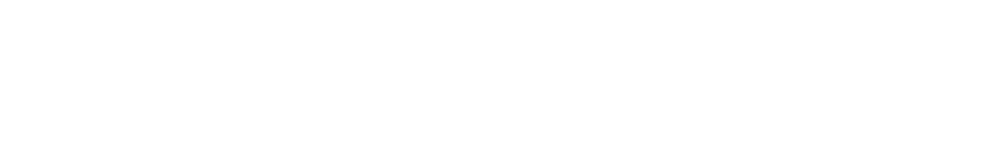
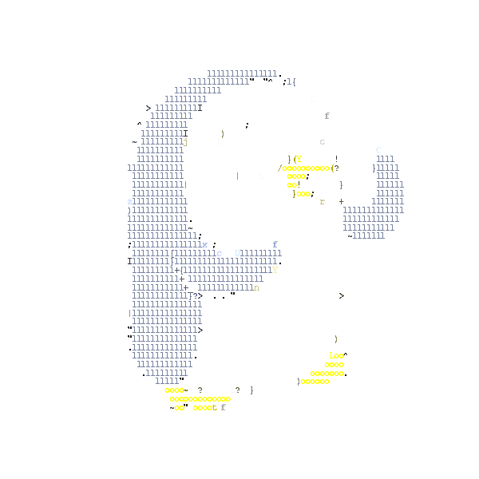

<picture>
  <source media="(prefers-color-scheme: dark)" srcset="banner_white.png">
  <source media="(prefers-color-scheme: light)" srcset="banner_black.png">
  
</picture>

 

 

### Vulnerability Disclosures

| Reference / CVE | Vendor & Description |
| :--- | :--- |
| **[CVE-2026-24165](https://nvidia.custhelp.com/app/answers/detail/a_id/5808)** | **Nvidia** - BioNeMo Framework Remote Code Execution via Insecure Deserialization |
| **[CVE-2026-42610](https://github.com/getgrav/grav/security/advisories/GHSA-3f29-pqwf-v4j4)** | **Grav CMS** - Information disclosure via sandbox escape |

 

